# Rust gRPC servicers vs Python servicers vs native HTTP: SGLang, vLLM and TokenSpeed on nvidia/Qwen3.8-27B-NVFP4

## Setup

- **Model.** `nvidia/Qwen3.8-27B-NVFP4` (a Qwen3.5-family hybrid-attention model, mixed FP8/NVFP4 checkpoint), one GPU per replica, every engine with its own default settings.
- **Host.** One aarch64 host with 4 GPUs, all software and the model on local disk. Only one worker set is alive at a time; each stack ran one lifetime with 2 passes, so every table cell is the mean of up to 2 runs (the spread column is (max-min)/mean of requests per second across those runs).
- **Engines.** SGLang 0.5.20 (the CI pin), vLLM nightly 0.30.1rc1.dev640 (torch 2.13, CUDA 13), TokenSpeed nightly 0.1.0.post20261004 (torch 2.14, CUDA 13, FlashInfer 0.7.1rc2). **Engine defaults everywhere**: the command lines carry the model, host, port and the entrypoint selector, nothing else. One exception, needed to run at all: the 4-replica TokenSpeed workers get `--kvstore-size 120` (GB of host cache each) because the default sizes the host cache from free RAM and four of them oversubscribe the host.
- **smg.** The gateway runs in gRPC mode in front of the engines' gRPC servicers and in HTTP mode in front of the native servers, with the tokenizer cache on (`--tokenizer-cache-enable-l0 --tokenizer-cache-enable-l1`) and the default routing policy. Python servicers: `python -m sglang.launch_server --grpc-mode`, `vllm serve --grpc`, `python -m smg_grpc_servicer.tokenspeed`. Rust servicers: the same entrypoints with `SMG_<ENGINE>_SERVICER_IMPL=rust` (smg's Rust servicer takes the gRPC port and drives the engine over its own in-process wire).
- **Baselines.** The SGLang and vLLM native HTTP servers (`python -m sglang.launch_server`, `vllm serve`) and vLLM's Rust frontend (`VLLM_USE_RUST_FRONTEND=1 vllm serve`), each measured directly and behind smg HTTP mode at 1 replica, and behind smg HTTP mode at 4 replicas (where a load balancer is needed).
- **Load.** `/v1/completions`, streaming, `ignore_eos` so every request produces exactly the requested output length, each request carrying its own prompt pinned to the input length (no prefix-cache reuse across requests), `temperature 0.7`, token counts from the stream's usage. A shape is clients x input tokens x output tokens; a warm-up run precedes every measurement. TTFT is time to the first streamed token, TPOT the mean time per output token after the first, end-to-end the whole request. CPU seconds are the host CPU time consumed over the run by the worker's whole process tree (engine plus servicer) and by the smg process. A request that fails is counted and excluded from the latency statistics; cells with failures are marked.

Runs: 216 measured runs over 108 stack x topology x shape cells. Each cell below is the mean across lifetimes and passes.

## Headline comparisons, 1 replica

Ratios are the second stack over the first, geometric mean of per-shape means; for latency and CPU below 1.00 means the second stack is lower. Failed requests are totals over all runs of the comparison.

- **SGLang: smg gRPC with the Rust servicer vs the Python servicer** (1 replica, 9 shapes): throughput x1.000, TTFT p50 x1.01, TTFT p99 x0.97, TPOT x0.997, worker-tree CPU x0.56; failed requests 0/8512 vs 0/8512.
- **vLLM: smg gRPC with the Rust servicer vs the Python servicer** (1 replica, 9 shapes): throughput x1.002, TTFT p50 x1.00, TTFT p99 x0.98, TPOT x0.997, worker-tree CPU x0.63; failed requests 0/8512 vs 0/8512.
- **TokenSpeed: smg gRPC with the Rust servicer vs the Python servicer** (1 replica, 9 shapes): throughput x1.002, TTFT p50 x0.98, TTFT p99 x0.96, TPOT x1.000, worker-tree CPU x1.05; failed requests 0/8512 vs 0/8512.
- **smg gRPC (Rust servicer) vs SGLang's native HTTP server, direct** (1 replica, 9 shapes): throughput x0.996, TTFT p50 x0.97, TTFT p99 x0.98, TPOT x1.012, worker-tree CPU x0.49; failed requests 0/8512 vs 18/8512.
- **smg gRPC (Rust servicer) vs vLLM's native HTTP server, direct** (1 replica, 9 shapes): throughput x0.986, TTFT p50 x1.04, TTFT p99 x0.99, TPOT x1.009, worker-tree CPU x0.46; failed requests 0/8512 vs 0/8512.
- **smg gRPC (Rust servicer) vs vLLM's Rust frontend, direct** (1 replica, 9 shapes): throughput x0.989, TTFT p50 x1.14, TTFT p99 x0.95, TPOT x0.983, worker-tree CPU x463.42; failed requests 0/8512 vs 0/8512.

### SGLang, smg gRPC mode: Python servicer vs Rust servicer, 1 replica

| shape | req/s (Python / Rust) | TTFT p50 ms (Python / Rust) | TTFT p99 ms (Python / Rust) | TPOT ms (Python / Rust) | e2e p99 ms (Python / Rust) | worker CPU s (Python / Rust) | failed req |
|---|---:|---:|---:|---:|---:|---:|---:|
| c1-i512-o128 | 1.25 / 1.28 | 68 / 65 | 111 / 106 | 5.77 / 5.63 | 844 / 822 | 1.0 / 0.5 | 0/64 / 0/64 |
| c8-i256-o128 | 8.75 / 8.77 | 127 / 122 | 149 / 141 | 6.19 / 6.20 | 937 / 931 | 1.2 / 0.7 | 0/256 / 0/256 |
| c16-i512-o2048 | 1.06 / 1.06 | 241 / 236 | 267 / 245 | 7.24 / 7.23 | 15,096 / 15,083 | 7.3 / 4.6 | 0/128 / 0/128 |
| c32-i1024-o256 | 10.88 / 10.92 | 532 / 526 | 778 / 772 | 9.45 / 9.45 | 2,952 / 2,945 | 5.3 / 2.8 | 0/768 / 0/768 |
| c32-i4096-o256 | 5.56 / 5.58 | 1,763 / 1,737 | 3,157 / 3,143 | 15.60 / 15.66 | 5,762 / 5,747 | 4.2 / 2.4 | 0/512 / 0/512 |
| c64-i2048-o1024 | 4.09 / 4.09 | 1,661 / 1,733 | 2,992 / 2,976 | 13.63 / 13.52 | 15,694 / 15,792 | 10.1 / 4.6 | 0/384 / 0/384 |
| c64-i8192-o256 | 3.27 / 3.29 | 7,535 / 7,468 | 14,379 / 14,312 | 46.94 / 47.23 | 19,571 / 19,552 | 2.0 / 1.2 | 0/256 / 0/256 |
| c128-i1024-o256 | 17.62 / 17.16 | 1,593 / 1,823 | 3,419 / 3,322 | 21.71 / 21.54 | 8,170 / 7,809 | 13.8 / 9.0 | 0/2048 / 0/2048 |
| c256-i1024-o256 | 18.81 / 18.73 | 8,174 / 8,277 | 10,573 / 10,168 | 21.98 / 22.11 | 15,682 / 15,379 | 28.6 / 17.6 | 0/4096 / 0/4096 |
| **Rust / Python, geometric mean** | **x1.000** | **x1.007** | **x0.969** | **x0.997** | **x0.989** | **x0.563** | |

### vLLM, smg gRPC mode: Python servicer vs Rust servicer, 1 replica

| shape | req/s (Python / Rust) | TTFT p50 ms (Python / Rust) | TTFT p99 ms (Python / Rust) | TPOT ms (Python / Rust) | e2e p99 ms (Python / Rust) | worker CPU s (Python / Rust) | failed req |
|---|---:|---:|---:|---:|---:|---:|---:|
| c1-i512-o128 | 1.21 / 1.21 | 60 / 54 | 92 / 87 | 6.05 / 6.06 | 860 / 856 | 0.8 / 0.6 | 0/64 / 0/64 |
| c8-i256-o128 | 7.47 / 7.30 | 228 / 246 | 295 / 323 | 6.58 / 6.59 | 1,130 / 1,159 | 1.0 / 0.8 | 0/256 / 0/256 |
| c16-i512-o2048 | 1.04 / 1.04 | 224 / 231 | 255 / 268 | 7.38 / 7.39 | 15,382 / 15,396 | 6.4 / 5.0 | 0/128 / 0/128 |
| c32-i1024-o256 | 10.86 / 10.82 | 752 / 788 | 1,030 / 977 | 8.41 / 8.42 | 3,176 / 3,126 | 4.8 / 3.7 | 0/768 / 0/768 |
| c32-i4096-o256 | 6.38 / 6.45 | 1,740 / 1,719 | 2,739 / 2,668 | 12.65 / 12.65 | 6,091 / 5,971 | 3.6 / 2.6 | 0/512 / 0/512 |
| c64-i2048-o1024 | 4.46 / 4.47 | 1,464 / 1,566 | 2,648 / 2,564 | 12.59 / 12.46 | 15,804 / 15,535 | 8.8 / 5.2 | 0/384 / 0/384 |
| c64-i8192-o256 | 4.71 / 4.72 | 2,214 / 2,069 | 10,124 / 10,082 | 43.66 / 44.19 | 21,732 / 21,756 | 1.7 / 1.1 | 0/256 / 0/256 |
| c128-i1024-o256 | 19.78 / 19.89 | 1,371 / 1,358 | 2,764 / 2,766 | 19.71 / 19.84 | 7,931 / 7,997 | 14.8 / 5.5 | 0/2048 / 0/2048 |
| c256-i1024-o256 | 19.69 / 20.04 | 1,344 / 1,314 | 7,727 / 6,916 | 47.20 / 45.36 | 20,279 / 19,027 | 31.6 / 13.8 | 0/4096 / 0/4096 |
| **Rust / Python, geometric mean** | **x1.002** | **x0.999** | **x0.984** | **x0.997** | **x0.991** | **x0.632** | |

### TokenSpeed, smg gRPC mode: Python servicer vs Rust servicer, 1 replica

| shape | req/s (Python / Rust) | TTFT p50 ms (Python / Rust) | TTFT p99 ms (Python / Rust) | TPOT ms (Python / Rust) | e2e p99 ms (Python / Rust) | worker CPU s (Python / Rust) | failed req |
|---|---:|---:|---:|---:|---:|---:|---:|
| c1-i512-o128 | 1.15 / 1.15 | 52 / 52 | 89 / 93 | 6.41 / 6.41 | 903 / 910 | 0.9 / 0.9 | 0/64 / 0/64 |
| c8-i256-o128 | 7.89 / 8.03 | 113 / 92 | 143 / 147 | 7.05 / 7.04 | 1,053 / 1,067 | 1.2 / 1.3 | 0/256 / 0/256 |
| c16-i512-o2048 | 0.96 / 0.96 | 210 / 217 | 248 / 250 | 8.02 / 8.02 | 16,678 / 16,699 | 7.8 / 8.1 | 0/128 / 0/128 |
| c32-i1024-o256 | 10.42 / 10.61 | 400 / 382 | 1,203 / 722 | 10.30 / 10.30 | 3,555 / 3,086 | 5.8 / 5.8 | 0/768 / 0/768 |
| c32-i4096-o256 | 6.08 / 6.04 | 1,436 / 1,440 | 2,672 / 2,678 | 14.94 / 14.99 | 5,314 / 5,380 | 3.8 / 4.6 | 0/512 / 0/512 |
| c64-i2048-o1024 | 4.27 / 4.25 | 1,407 / 1,419 | 2,666 / 2,677 | 13.21 / 13.26 | 15,035 / 15,134 | 10.8 / 10.6 | 0/384 / 0/384 |
| c64-i8192-o256 | 4.21 / 4.22 | 5,567 / 5,571 | 10,904 / 10,888 | 37.48 / 37.50 | 15,255 / 15,253 | 2.0 / 2.6 | 0/256 / 0/256 |
| c128-i1024-o256 | 17.05 / 16.84 | 1,715 / 1,822 | 3,157 / 3,279 | 22.30 / 22.20 | 7,956 / 8,078 | 15.7 / 13.3 | 0/2048 / 0/2048 |
| c256-i1024-o256 | 18.85 / 18.95 | 5,369 / 5,341 | 10,180 / 10,158 | 28.87 / 28.84 | 17,267 / 17,140 | 32.6 / 35.2 | 0/4096 / 0/4096 |
| **Rust / Python, geometric mean** | **x1.002** | **x0.983** | **x0.957** | **x1.000** | **x0.990** | **x1.052** | |

### SGLang native HTTP server (direct) vs smg gRPC mode with the Rust servicer, 1 replica

| shape | req/s (SGLang HTTP direct / smg gRPC Rust) | TTFT p50 ms (SGLang HTTP direct / smg gRPC Rust) | TTFT p99 ms (SGLang HTTP direct / smg gRPC Rust) | TPOT ms (SGLang HTTP direct / smg gRPC Rust) | e2e p99 ms (SGLang HTTP direct / smg gRPC Rust) | worker CPU s (SGLang HTTP direct / smg gRPC Rust) | failed req |
|---|---:|---:|---:|---:|---:|---:|---:|
| c1-i512-o128 | 1.28 / 1.28 | 66 / 65 | 105 / 106 | 5.62 / 5.63 | 814 / 822 | 0.8 / 0.5 | 0/64 / 0/64 |
| c8-i256-o128 | 8.74 / 8.77 | 128 / 122 | 149 / 141 | 6.18 / 6.20 | 934 / 931 | 1.2 / 0.7 | 0/256 / 0/256 |
| c16-i512-o2048 | 1.07 / 1.06 | 242 / 236 | 249 / 245 | 7.21 / 7.23 | 15,029 / 15,083 | 6.1 / 4.6 | 0/128 / 0/128 |
| c32-i1024-o256 | 10.86 / 10.92 | 747 / 526 | 796 / 772 | 8.56 / 9.45 | 2,976 / 2,945 | 5.4 / 2.8 | 0/768 / 0/768 |
| c32-i4096-o256 | 5.59 / 5.58 | 1,744 / 1,737 | 3,140 / 3,143 | 15.57 / 15.66 | 5,743 / 5,747 | 6.2 / 2.4 | 0/512 / 0/512 |
| c64-i2048-o1024 | 4.11 / 4.09 | 1,719 / 1,733 | 2,980 / 2,976 | 13.48 / 13.52 | 15,641 / 15,792 | 9.2 / 4.6 | 0/384 / 0/384 |
| c64-i8192-o256 | 3.29 / 3.29 | 7,460 / 7,468 | 14,282 / 14,312 | 46.86 / 47.23 | 19,486 / 19,552 | 4.6 / 1.2 | 0/256 / 0/256 |
| c128-i1024-o256 | 17.59 / 17.16 | 1,518 / 1,823 | 3,437 / 3,322 | 22.30 / 21.54 | 7,864 / 7,809 | 17.0 / 9.0 | 0/2048 / 0/2048 |
| c256-i1024-o256 | 18.78 / 18.73 | 8,322 / 8,277 | 10,322 / 10,168 | 21.73 / 22.11 | 15,238 / 15,379 | 34.9 / 17.6 | 18/4096 / 0/4096 |
| **smg gRPC Rust / SGLang HTTP direct, geometric mean** | **x0.996** | **x0.972** | **x0.984** | **x1.012** | **x1.002** | **x0.492** | |

### vLLM native HTTP server (direct) vs smg gRPC mode with the Rust servicer, 1 replica

| shape | req/s (vLLM HTTP direct / smg gRPC Rust) | TTFT p50 ms (vLLM HTTP direct / smg gRPC Rust) | TTFT p99 ms (vLLM HTTP direct / smg gRPC Rust) | TPOT ms (vLLM HTTP direct / smg gRPC Rust) | e2e p99 ms (vLLM HTTP direct / smg gRPC Rust) | worker CPU s (vLLM HTTP direct / smg gRPC Rust) | failed req |
|---|---:|---:|---:|---:|---:|---:|---:|
| c1-i512-o128 | 1.21 / 1.21 | 58 / 54 | 101 / 87 | 6.05 / 6.06 | 868 / 856 | 1.1 / 0.6 | 0/64 / 0/64 |
| c8-i256-o128 | 7.49 / 7.30 | 228 / 246 | 263 / 323 | 6.58 / 6.59 | 1,097 / 1,159 | 1.3 / 0.8 | 0/256 / 0/256 |
| c16-i512-o2048 | 1.04 / 1.04 | 236 / 231 | 274 / 268 | 7.38 / 7.39 | 15,386 / 15,396 | 6.1 / 5.0 | 0/128 / 0/128 |
| c32-i1024-o256 | 10.77 / 10.82 | 777 / 788 | 1,077 / 977 | 8.42 / 8.42 | 3,209 / 3,126 | 5.9 / 3.7 | 0/768 / 0/768 |
| c32-i4096-o256 | 6.42 / 6.45 | 1,607 / 1,719 | 2,685 / 2,668 | 13.23 / 12.65 | 6,129 / 5,971 | 7.7 / 2.6 | 0/512 / 0/512 |
| c64-i2048-o1024 | 4.44 / 4.47 | 1,382 / 1,566 | 2,827 / 2,564 | 12.67 / 12.46 | 16,087 / 15,535 | 9.1 / 5.2 | 0/384 / 0/384 |
| c64-i8192-o256 | 4.71 / 4.72 | 1,933 / 2,069 | 10,043 / 10,082 | 45.02 / 44.19 | 21,943 / 21,756 | 6.0 / 1.1 | 0/256 / 0/256 |
| c128-i1024-o256 | 19.52 / 19.89 | 1,281 / 1,358 | 3,184 / 2,766 | 20.28 / 19.84 | 8,668 / 7,997 | 16.7 / 5.5 | 0/2048 / 0/2048 |
| c256-i1024-o256 | 23.09 / 20.04 | 1,236 / 1,314 | 5,585 / 6,916 | 37.78 / 45.36 | 14,982 / 19,027 | 30.0 / 13.8 | 0/4096 / 0/4096 |
| **smg gRPC Rust / vLLM HTTP direct, geometric mean** | **x0.986** | **x1.043** | **x0.990** | **x1.009** | **x1.012** | **x0.461** | |

### vLLM Rust frontend (direct) vs smg gRPC mode with the Rust servicer, 1 replica

| shape | req/s (vLLM Rust frontend direct / smg gRPC Rust) | TTFT p50 ms (vLLM Rust frontend direct / smg gRPC Rust) | TTFT p99 ms (vLLM Rust frontend direct / smg gRPC Rust) | TPOT ms (vLLM Rust frontend direct / smg gRPC Rust) | e2e p99 ms (vLLM Rust frontend direct / smg gRPC Rust) | worker CPU s (vLLM Rust frontend direct / smg gRPC Rust) | failed req |
|---|---:|---:|---:|---:|---:|---:|---:|
| c1-i512-o128 | 1.21 / 1.21 | 53 / 54 | 94 / 87 | 6.05 / 6.06 | 894 / 856 | 0.0 / 0.6 | 0/64 / 0/64 |
| c8-i256-o128 | 7.30 / 7.30 | 239 / 246 | 365 / 323 | 6.59 / 6.59 | 1,201 / 1,159 | 0.0 / 0.8 | 0/256 / 0/256 |
| c16-i512-o2048 | 1.04 / 1.04 | 300 / 231 | 385 / 268 | 7.38 / 7.39 | 15,506 / 15,396 | 0.0 / 5.0 | 0/128 / 0/128 |
| c32-i1024-o256 | 10.65 / 10.82 | 793 / 788 | 1,080 / 977 | 8.42 / 8.42 | 3,305 / 3,126 | 0.0 / 3.7 | 0/768 / 0/768 |
| c32-i4096-o256 | 6.46 / 6.45 | 1,050 / 1,719 | 2,655 / 2,668 | 15.28 / 12.65 | 6,707 / 5,971 | 0.0 / 2.6 | 0/512 / 0/512 |
| c64-i2048-o1024 | 4.39 / 4.47 | 1,157 / 1,566 | 2,770 / 2,564 | 13.02 / 12.46 | 16,326 / 15,535 | 0.0 / 5.2 | 0/384 / 0/384 |
| c64-i8192-o256 | 4.68 / 4.72 | 1,514 / 2,069 | 10,180 / 10,082 | 47.19 / 44.19 | 22,679 / 21,756 | 0.0 / 1.1 | 0/256 / 0/256 |
| c128-i1024-o256 | 20.36 / 19.89 | 1,104 / 1,358 | 2,702 / 2,766 | 20.24 / 19.84 | 8,206 / 7,997 | 0.0 / 5.5 | 0/2048 / 0/2048 |
| c256-i1024-o256 | 22.72 / 20.04 | 1,214 / 1,314 | 5,404 / 6,916 | 38.66 / 45.36 | 15,240 / 19,027 | 0.0 / 13.8 | 0/4096 / 0/4096 |
| **smg gRPC Rust / vLLM Rust frontend direct, geometric mean** | **x0.989** | **x1.140** | **x0.948** | **x0.983** | **x0.983** | **x463.416** | |

## Findings

Ratios are Rust/Python or stack/baseline of the per-shape means; for latency and CPU a ratio below 1 means the Rust servicer or the stack in question is lower.

- **SGLang, 1 replica, Rust servicer vs Python servicer** (geometric mean of the per-shape ratios over 9 shapes): throughput x1.000, TPOT p50 x0.997, TTFT p99 x0.97, worker-tree CPU x0.56, smg CPU x1.07.
- **vLLM, 1 replica, Rust servicer vs Python servicer** (geometric mean of the per-shape ratios over 9 shapes): throughput x1.002, TPOT p50 x0.997, TTFT p99 x0.98, worker-tree CPU x0.63, smg CPU x1.17.
- **TokenSpeed, 1 replica, Rust servicer vs Python servicer** (geometric mean of the per-shape ratios over 9 shapes): throughput x1.002, TPOT p50 x1.000, TTFT p99 x0.96, worker-tree CPU x1.05, smg CPU x1.03.
- **SGLang, 1 replica, relative to its native HTTP server, direct**: behind smg HTTP mode: throughput x0.999, TTFT p99 x1.01, TPOT p50 x1.001 (9 shapes); smg gRPC mode with the Python servicer: throughput x0.996, TTFT p99 x1.02, TPOT p50 x1.015 (9 shapes); smg gRPC mode with the Rust servicer: throughput x0.996, TTFT p99 x0.98, TPOT p50 x1.012 (9 shapes).
- **vLLM, 1 replica, relative to its native HTTP server, direct**: behind smg HTTP mode: throughput x1.001, TTFT p99 x0.98, TPOT p50 x0.996 (9 shapes); smg gRPC mode with the Python servicer: throughput x0.984, TTFT p99 x1.01, TPOT p50 x1.013 (9 shapes); smg gRPC mode with the Rust servicer: throughput x0.986, TTFT p99 x0.99, TPOT p50 x1.009 (9 shapes); vLLM Rust frontend, direct: throughput x0.997, TTFT p99 x1.04, TPOT p50 x1.027 (9 shapes); vLLM Rust frontend behind smg HTTP mode: throughput x1.001, TTFT p99 x0.98, TPOT p50 x1.024 (9 shapes).

## 1 replica

### Requests / s, 1 replica

| shape (clients-input-output) | SGLang Python servicer | SGLang Rust servicer | vLLM Python servicer | vLLM Rust servicer | TokenSpeed Python servicer | TokenSpeed Rust servicer | SGLang HTTP direct | SGLang HTTP + smg | vLLM HTTP direct | vLLM HTTP + smg | vLLM Rust frontend direct | vLLM Rust frontend + smg |
|---|---:|---:|---:|---:|---:|---:|---:|---:|---:|---:|---:|---:|
| c1-i512-o128 | 1.25 | 1.28 | 1.21 | 1.21 | 1.15 | 1.15 | 1.28 | 1.28 | 1.21 | 1.21 | 1.21 | 1.22 |
| c8-i256-o128 | 8.75 | 8.77 | 7.47 | 7.30 | 7.89 | 8.03 | 8.74 | 8.75 | 7.49 | 7.38 | 7.30 | 7.33 |
| c16-i512-o2048 | 1.06 | 1.06 | 1.04 | 1.04 | 0.96 | 0.96 | 1.07 | 1.06 | 1.04 | 1.04 | 1.04 | 1.04 |
| c32-i1024-o256 | 10.88 | 10.92 | 10.86 | 10.82 | 10.42 | 10.61 | 10.86 | 10.84 | 10.77 | 10.80 | 10.65 | 10.37 |
| c32-i4096-o256 | 5.56 | 5.58 | 6.38 | 6.45 | 6.08 | 6.04 | 5.59 | 5.59 | 6.42 | 6.45 | 6.46 | 6.55 |
| c64-i2048-o1024 | 4.09 | 4.09 | 4.46 | 4.47 | 4.27 | 4.25 | 4.11 | 4.11 | 4.44 | 4.47 | 4.39 | 4.46 |
| c64-i8192-o256 | 3.27 | 3.29 | 4.71 | 4.72 | 4.21 | 4.22 | 3.29 | 3.29 | 4.71 | 4.72 | 4.68 | 4.72 |
| c128-i1024-o256 | 17.62 | 17.16 | 19.78 | 19.89 | 17.05 | 16.84 | 17.59 | 17.42 | 19.52 | 19.80 | 20.36 | 20.23 |
| c256-i1024-o256 | 18.81 | 18.73 | 19.69 | 20.04 | 18.85 | 18.95 | 18.78* | 18.82 | 23.09 | 22.91 | 22.72 | 23.02 |

\* some requests in this cell failed; the number covers the successful ones (counts in the full table).

### Output tokens / s, 1 replica

| shape (clients-input-output) | SGLang Python servicer | SGLang Rust servicer | vLLM Python servicer | vLLM Rust servicer | TokenSpeed Python servicer | TokenSpeed Rust servicer | SGLang HTTP direct | SGLang HTTP + smg | vLLM HTTP direct | vLLM HTTP + smg | vLLM Rust frontend direct | vLLM Rust frontend + smg |
|---|---:|---:|---:|---:|---:|---:|---:|---:|---:|---:|---:|---:|
| c1-i512-o128 | 160 | 164 | 154 | 155 | 148 | 148 | 164 | 164 | 155 | 154 | 155 | 156 |
| c8-i256-o128 | 1,119 | 1,122 | 957 | 935 | 1,010 | 1,028 | 1,119 | 1,120 | 958 | 946 | 935 | 938 |
| c16-i512-o2048 | 2,174 | 2,178 | 2,134 | 2,132 | 1,970 | 1,967 | 2,185 | 2,183 | 2,134 | 2,132 | 2,123 | 2,132 |
| c32-i1024-o256 | 2,785 | 2,795 | 2,780 | 2,771 | 2,668 | 2,714 | 2,779 | 2,775 | 2,756 | 2,767 | 2,727 | 2,653 |
| c32-i4096-o256 | 1,425 | 1,428 | 1,634 | 1,651 | 1,556 | 1,548 | 1,432 | 1,431 | 1,642 | 1,650 | 1,654 | 1,677 |
| c64-i2048-o1024 | 4,193 | 4,184 | 4,568 | 4,581 | 4,372 | 4,356 | 4,208 | 4,203 | 4,548 | 4,581 | 4,502 | 4,561 |
| c64-i8192-o256 | 839 | 841 | 1,205 | 1,208 | 1,080 | 1,081 | 844 | 843 | 1,207 | 1,210 | 1,199 | 1,210 |
| c128-i1024-o256 | 4,510 | 4,392 | 5,063 | 5,091 | 4,365 | 4,311 | 4,502 | 4,461 | 4,997 | 5,068 | 5,214 | 5,178 |
| c256-i1024-o256 | 4,817 | 4,796 | 5,041 | 5,128 | 4,825 | 4,852 | 4,808* | 4,819 | 5,910 | 5,863 | 5,816 | 5,891 |

\* some requests in this cell failed; the number covers the successful ones (counts in the full table).

### TTFT p50 (ms), 1 replica

| shape (clients-input-output) | SGLang Python servicer | SGLang Rust servicer | vLLM Python servicer | vLLM Rust servicer | TokenSpeed Python servicer | TokenSpeed Rust servicer | SGLang HTTP direct | SGLang HTTP + smg | vLLM HTTP direct | vLLM HTTP + smg | vLLM Rust frontend direct | vLLM Rust frontend + smg |
|---|---:|---:|---:|---:|---:|---:|---:|---:|---:|---:|---:|---:|
| c1-i512-o128 | 68 | 65 | 60 | 54 | 52 | 52 | 66 | 69 | 58 | 60 | 53 | 51 |
| c8-i256-o128 | 127 | 122 | 228 | 246 | 113 | 92 | 128 | 129 | 228 | 242 | 239 | 237 |
| c16-i512-o2048 | 241 | 236 | 224 | 231 | 210 | 217 | 242 | 245 | 236 | 242 | 300 | 233 |
| c32-i1024-o256 | 532 | 526 | 752 | 788 | 400 | 382 | 747 | 746 | 777 | 794 | 793 | 876 |
| c32-i4096-o256 | 1,763 | 1,737 | 1,740 | 1,719 | 1,436 | 1,440 | 1,744 | 1,741 | 1,607 | 1,544 | 1,050 | 1,019 |
| c64-i2048-o1024 | 1,661 | 1,733 | 1,464 | 1,566 | 1,407 | 1,419 | 1,719 | 1,761 | 1,382 | 1,344 | 1,157 | 1,113 |
| c64-i8192-o256 | 7,535 | 7,468 | 2,214 | 2,069 | 5,567 | 5,571 | 7,460 | 7,489 | 1,933 | 2,075 | 1,514 | 1,507 |
| c128-i1024-o256 | 1,593 | 1,823 | 1,371 | 1,358 | 1,715 | 1,822 | 1,518 | 1,545 | 1,281 | 1,381 | 1,104 | 1,078 |
| c256-i1024-o256 | 8,174 | 8,277 | 1,344 | 1,314 | 5,369 | 5,341 | 8,322* | 8,332 | 1,236 | 1,398 | 1,214 | 1,442 |

\* some requests in this cell failed; the number covers the successful ones (counts in the full table).

### TTFT p99 (ms), 1 replica

| shape (clients-input-output) | SGLang Python servicer | SGLang Rust servicer | vLLM Python servicer | vLLM Rust servicer | TokenSpeed Python servicer | TokenSpeed Rust servicer | SGLang HTTP direct | SGLang HTTP + smg | vLLM HTTP direct | vLLM HTTP + smg | vLLM Rust frontend direct | vLLM Rust frontend + smg |
|---|---:|---:|---:|---:|---:|---:|---:|---:|---:|---:|---:|---:|
| c1-i512-o128 | 111 | 106 | 92 | 87 | 89 | 93 | 105 | 107 | 101 | 100 | 94 | 86 |
| c8-i256-o128 | 149 | 141 | 295 | 323 | 143 | 147 | 149 | 150 | 263 | 295 | 365 | 360 |
| c16-i512-o2048 | 267 | 245 | 255 | 268 | 248 | 250 | 249 | 270 | 274 | 278 | 385 | 264 |
| c32-i1024-o256 | 778 | 772 | 1,030 | 977 | 1,203 | 722 | 796 | 802 | 1,077 | 991 | 1,080 | 1,153 |
| c32-i4096-o256 | 3,157 | 3,143 | 2,739 | 2,668 | 2,672 | 2,678 | 3,140 | 3,141 | 2,685 | 2,591 | 2,655 | 2,526 |
| c64-i2048-o1024 | 2,992 | 2,976 | 2,648 | 2,564 | 2,666 | 2,677 | 2,980 | 2,972 | 2,827 | 2,620 | 2,770 | 2,566 |
| c64-i8192-o256 | 14,379 | 14,312 | 10,124 | 10,082 | 10,904 | 10,888 | 14,282 | 14,312 | 10,043 | 9,991 | 10,180 | 9,982 |
| c128-i1024-o256 | 3,419 | 3,322 | 2,764 | 2,766 | 3,157 | 3,279 | 3,437 | 3,380 | 3,184 | 2,789 | 2,702 | 2,595 |
| c256-i1024-o256 | 10,573 | 10,168 | 7,727 | 6,916 | 10,180 | 10,158 | 10,322* | 10,160 | 5,585 | 5,546 | 5,404 | 5,422 |

\* some requests in this cell failed; the number covers the successful ones (counts in the full table).

### TPOT p50 (ms), 1 replica

| shape (clients-input-output) | SGLang Python servicer | SGLang Rust servicer | vLLM Python servicer | vLLM Rust servicer | TokenSpeed Python servicer | TokenSpeed Rust servicer | SGLang HTTP direct | SGLang HTTP + smg | vLLM HTTP direct | vLLM HTTP + smg | vLLM Rust frontend direct | vLLM Rust frontend + smg |
|---|---:|---:|---:|---:|---:|---:|---:|---:|---:|---:|---:|---:|
| c1-i512-o128 | 5.77 | 5.63 | 6.05 | 6.06 | 6.41 | 6.41 | 5.62 | 5.62 | 6.05 | 6.05 | 6.05 | 6.05 |
| c8-i256-o128 | 6.19 | 6.20 | 6.58 | 6.59 | 7.05 | 7.04 | 6.18 | 6.18 | 6.58 | 6.57 | 6.59 | 6.63 |
| c16-i512-o2048 | 7.24 | 7.23 | 7.38 | 7.39 | 8.02 | 8.02 | 7.21 | 7.21 | 7.38 | 7.39 | 7.38 | 7.39 |
| c32-i1024-o256 | 9.45 | 9.45 | 8.41 | 8.42 | 10.30 | 10.30 | 8.56 | 8.57 | 8.42 | 8.38 | 8.42 | 8.43 |
| c32-i4096-o256 | 15.60 | 15.66 | 12.65 | 12.65 | 14.94 | 14.99 | 15.57 | 15.59 | 13.23 | 13.46 | 15.28 | 15.20 |
| c64-i2048-o1024 | 13.63 | 13.52 | 12.59 | 12.46 | 13.21 | 13.26 | 13.48 | 13.50 | 12.67 | 12.62 | 13.02 | 12.94 |
| c64-i8192-o256 | 46.94 | 47.23 | 43.66 | 44.19 | 37.48 | 37.50 | 46.86 | 46.89 | 45.02 | 44.28 | 47.19 | 47.05 |
| c128-i1024-o256 | 21.71 | 21.54 | 19.71 | 19.84 | 22.30 | 22.20 | 22.30 | 22.46 | 20.28 | 19.75 | 20.24 | 20.41 |
| c256-i1024-o256 | 21.98 | 22.11 | 47.20 | 45.36 | 28.87 | 28.84 | 21.73* | 21.61 | 37.78 | 37.69 | 38.66 | 37.52 |

\* some requests in this cell failed; the number covers the successful ones (counts in the full table).

### End-to-end p99 (ms), 1 replica

| shape (clients-input-output) | SGLang Python servicer | SGLang Rust servicer | vLLM Python servicer | vLLM Rust servicer | TokenSpeed Python servicer | TokenSpeed Rust servicer | SGLang HTTP direct | SGLang HTTP + smg | vLLM HTTP direct | vLLM HTTP + smg | vLLM Rust frontend direct | vLLM Rust frontend + smg |
|---|---:|---:|---:|---:|---:|---:|---:|---:|---:|---:|---:|---:|
| c1-i512-o128 | 844 | 822 | 860 | 856 | 903 | 910 | 814 | 817 | 868 | 868 | 894 | 855 |
| c8-i256-o128 | 937 | 931 | 1,130 | 1,159 | 1,053 | 1,067 | 934 | 932 | 1,097 | 1,129 | 1,201 | 1,197 |
| c16-i512-o2048 | 15,096 | 15,083 | 15,382 | 15,396 | 16,678 | 16,699 | 15,029 | 15,032 | 15,386 | 15,403 | 15,506 | 15,401 |
| c32-i1024-o256 | 2,952 | 2,945 | 3,176 | 3,126 | 3,555 | 3,086 | 2,976 | 2,981 | 3,209 | 3,120 | 3,305 | 3,329 |
| c32-i4096-o256 | 5,762 | 5,747 | 6,091 | 5,971 | 5,314 | 5,380 | 5,743 | 5,738 | 6,129 | 6,032 | 6,707 | 6,645 |
| c64-i2048-o1024 | 15,694 | 15,792 | 15,804 | 15,535 | 15,035 | 15,134 | 15,641 | 15,658 | 16,087 | 15,800 | 16,326 | 16,082 |
| c64-i8192-o256 | 19,571 | 19,552 | 21,732 | 21,756 | 15,255 | 15,253 | 19,486 | 19,497 | 21,943 | 21,704 | 22,679 | 22,449 |
| c128-i1024-o256 | 8,170 | 7,809 | 7,931 | 7,997 | 7,956 | 8,078 | 7,864 | 7,852 | 8,668 | 7,827 | 8,206 | 8,044 |
| c256-i1024-o256 | 15,682 | 15,379 | 20,279 | 19,027 | 17,267 | 17,140 | 15,238* | 15,070 | 14,982 | 15,249 | 15,240 | 14,975 |

\* some requests in this cell failed; the number covers the successful ones (counts in the full table).

### Worker-tree CPU (s), 1 replica

| shape (clients-input-output) | SGLang Python servicer | SGLang Rust servicer | vLLM Python servicer | vLLM Rust servicer | TokenSpeed Python servicer | TokenSpeed Rust servicer | SGLang HTTP direct | SGLang HTTP + smg | vLLM HTTP direct | vLLM HTTP + smg | vLLM Rust frontend direct | vLLM Rust frontend + smg |
|---|---:|---:|---:|---:|---:|---:|---:|---:|---:|---:|---:|---:|
| c1-i512-o128 | 1.0 | 0.5 | 0.8 | 0.6 | 0.9 | 0.9 | 0.8 | 1.0 | 1.1 | 1.0 | 0.0 | 0.0 |
| c8-i256-o128 | 1.2 | 0.7 | 1.0 | 0.8 | 1.2 | 1.3 | 1.2 | 1.2 | 1.3 | 1.3 | 0.0 | 0.0 |
| c16-i512-o2048 | 7.3 | 4.6 | 6.4 | 5.0 | 7.8 | 8.1 | 6.1 | 6.5 | 6.1 | 6.0 | 0.0 | 0.0 |
| c32-i1024-o256 | 5.3 | 2.8 | 4.8 | 3.7 | 5.8 | 5.8 | 5.4 | 5.8 | 5.9 | 6.4 | 0.0 | 0.0 |
| c32-i4096-o256 | 4.2 | 2.4 | 3.6 | 2.6 | 3.8 | 4.6 | 6.2 | 6.1 | 7.7 | 7.2 | 0.0 | 0.0 |
| c64-i2048-o1024 | 10.1 | 4.6 | 8.8 | 5.2 | 10.8 | 10.6 | 9.2 | 9.8 | 9.1 | 8.7 | 0.0 | 0.0 |
| c64-i8192-o256 | 2.0 | 1.2 | 1.7 | 1.1 | 2.0 | 2.6 | 4.6 | 5.1 | 6.0 | 6.0 | 0.0 | 0.0 |
| c128-i1024-o256 | 13.8 | 9.0 | 14.8 | 5.5 | 15.7 | 13.3 | 17.0 | 17.0 | 16.7 | 16.9 | 0.0 | 0.0 |
| c256-i1024-o256 | 28.6 | 17.6 | 31.6 | 13.8 | 32.6 | 35.2 | 34.9* | 35.3 | 30.0 | 30.2 | 0.0 | 0.0 |

\* some requests in this cell failed; the number covers the successful ones (counts in the full table).

### smg CPU (s), 1 replica

| shape (clients-input-output) | SGLang Python servicer | SGLang Rust servicer | vLLM Python servicer | vLLM Rust servicer | TokenSpeed Python servicer | TokenSpeed Rust servicer | SGLang HTTP direct | SGLang HTTP + smg | vLLM HTTP direct | vLLM HTTP + smg | vLLM Rust frontend direct | vLLM Rust frontend + smg |
|---|---:|---:|---:|---:|---:|---:|---:|---:|---:|---:|---:|---:|
| c1-i512-o128 | 0.5 | 0.5 | 0.6 | 0.6 | 0.6 | 0.6 | 0.0 | 0.4 | 0.0 | 0.5 | 0.0 | 0.4 |
| c8-i256-o128 | 1.3 | 1.4 | 1.4 | 1.3 | 1.3 | 1.5 | 0.0 | 1.0 | 0.0 | 1.0 | 0.0 | 1.0 |
| c16-i512-o2048 | 6.9 | 6.9 | 5.6 | 7.0 | 6.4 | 6.9 | 0.0 | 6.1 | 0.0 | 6.9 | 0.0 | 5.4 |
| c32-i1024-o256 | 7.1 | 6.9 | 6.4 | 7.2 | 6.5 | 7.2 | 0.0 | 4.4 | 0.0 | 4.3 | 0.0 | 4.1 |
| c32-i4096-o256 | 9.3 | 9.2 | 9.1 | 9.5 | 9.2 | 9.1 | 0.0 | 3.2 | 0.0 | 4.0 | 0.0 | 2.7 |
| c64-i2048-o1024 | 10.9 | 11.8 | 10.1 | 13.9 | 10.7 | 11.3 | 0.0 | 7.6 | 0.0 | 7.7 | 0.0 | 7.8 |
| c64-i8192-o256 | 7.4 | 7.7 | 7.3 | 7.8 | 7.4 | 7.0 | 0.0 | 1.4 | 0.0 | 2.2 | 0.0 | 1.7 |
| c128-i1024-o256 | 18.1 | 22.4 | 16.4 | 25.0 | 18.3 | 20.1 | 0.0 | 10.8 | 0.0 | 13.0 | 0.0 | 10.0 |
| c256-i1024-o256 | 39.0 | 49.6 | 35.1 | 49.2 | 38.3 | 35.0 | 0.0* | 24.6 | 0.0 | 26.2 | 0.0 | 22.5 |

\* some requests in this cell failed; the number covers the successful ones (counts in the full table).

### Rust servicer / Python servicer, 1 replica (ratio of means; 1.00 = equal; latency and CPU rows below 1.00 favour Rust)

| engine | shape | req/s | out tok/s | TTFT p50 | TTFT p99 | TPOT p50 | e2e p99 | worker CPU | smg CPU |
|---|---|---:|---:|---:|---:|---:|---:|---:|---:|
| SGLang | c1-i512-o128 | 1.02 | 1.03 | 0.96 | 0.95 | 0.98 | 0.97 | 0.45 | 1.03 |
| vLLM | c1-i512-o128 | 1.01 | 1.01 | 0.89 | 0.94 | 1.00 | 1.00 | 0.71 | 0.94 |
| TokenSpeed | c1-i512-o128 | 1.00 | 1.00 | 1.00 | 1.04 | 1.00 | 1.01 | 1.00 | 0.98 |
| SGLang | c8-i256-o128 | 1.00 | 1.00 | 0.97 | 0.94 | 1.00 | 0.99 | 0.60 | 1.08 |
| vLLM | c8-i256-o128 | 0.98 | 0.98 | 1.08 | 1.10 | 1.00 | 1.03 | 0.82 | 0.92 |
| TokenSpeed | c8-i256-o128 | 1.02 | 1.02 | 0.81 | 1.03 | 1.00 | 1.01 | 1.09 | 1.17 |
| SGLang | c16-i512-o2048 | 1.00 | 1.00 | 0.98 | 0.92 | 1.00 | 1.00 | 0.63 | 1.00 |
| vLLM | c16-i512-o2048 | 1.00 | 1.00 | 1.03 | 1.05 | 1.00 | 1.00 | 0.78 | 1.26 |
| TokenSpeed | c16-i512-o2048 | 1.00 | 1.00 | 1.03 | 1.01 | 1.00 | 1.00 | 1.04 | 1.07 |
| SGLang | c32-i1024-o256 | 1.00 | 1.00 | 0.99 | 0.99 | 1.00 | 1.00 | 0.54 | 0.98 |
| vLLM | c32-i1024-o256 | 1.00 | 1.00 | 1.05 | 0.95 | 1.00 | 0.98 | 0.78 | 1.12 |
| TokenSpeed | c32-i1024-o256 | 1.02 | 1.02 | 0.96 | 0.60 | 1.00 | 0.87 | 1.00 | 1.10 |
| SGLang | c32-i4096-o256 | 1.00 | 1.00 | 0.99 | 1.00 | 1.00 | 1.00 | 0.58 | 0.99 |
| vLLM | c32-i4096-o256 | 1.01 | 1.01 | 0.99 | 0.97 | 1.00 | 0.98 | 0.72 | 1.05 |
| TokenSpeed | c32-i4096-o256 | 0.99 | 1.00 | 1.00 | 1.00 | 1.00 | 1.01 | 1.21 | 0.99 |
| SGLang | c64-i2048-o1024 | 1.00 | 1.00 | 1.04 | 0.99 | 0.99 | 1.01 | 0.45 | 1.08 |
| vLLM | c64-i2048-o1024 | 1.00 | 1.00 | 1.07 | 0.97 | 0.99 | 0.98 | 0.58 | 1.38 |
| TokenSpeed | c64-i2048-o1024 | 1.00 | 1.00 | 1.01 | 1.00 | 1.00 | 1.01 | 0.98 | 1.05 |
| SGLang | c64-i8192-o256 | 1.00 | 1.00 | 0.99 | 1.00 | 1.01 | 1.00 | 0.58 | 1.04 |
| vLLM | c64-i8192-o256 | 1.00 | 1.00 | 0.93 | 1.00 | 1.01 | 1.00 | 0.65 | 1.07 |
| TokenSpeed | c64-i8192-o256 | 1.00 | 1.00 | 1.00 | 1.00 | 1.00 | 1.00 | 1.28 | 0.95 |
| SGLang | c128-i1024-o256 | 0.97 | 0.97 | 1.14 | 0.97 | 0.99 | 0.96 | 0.65 | 1.24 |
| vLLM | c128-i1024-o256 | 1.01 | 1.01 | 0.99 | 1.00 | 1.01 | 1.01 | 0.37 | 1.52 |
| TokenSpeed | c128-i1024-o256 | 0.99 | 0.99 | 1.06 | 1.04 | 1.00 | 1.02 | 0.85 | 1.10 |
| SGLang | c256-i1024-o256 | 1.00 | 1.00 | 1.01 | 0.96 | 1.01 | 0.98 | 0.61 | 1.27 |
| vLLM | c256-i1024-o256 | 1.02 | 1.02 | 0.98 | 0.90 | 0.96 | 0.94 | 0.44 | 1.40 |
| TokenSpeed | c256-i1024-o256 | 1.01 | 1.01 | 0.99 | 1.00 | 1.00 | 0.99 | 1.08 | 0.91 |

### All metrics, 1 replica

| stack | shape | n | failed req | Requests / s | Output tokens / s | Input tokens / s | TTFT p50 (ms) | TTFT p99 (ms) | TPOT p50 (ms) | TPOT p99 (ms) | End-to-end p50 (ms) | End-to-end p99 (ms) | Worker-tree CPU (s) | smg CPU (s) | req/s spread |
|---|---|---:|---:|---:|---:|---:|---:|---:|---:|---:|---:|---:|---:|---:|---:|
| SGLang Python servicer | c1-i512-o128 | 2 | 0 | 1.25 | 160 | 639 | 68 | 111 | 5.77 | 5.78 | 800 | 844 | 1.0 | 0.5 | 0.0% |
| SGLang Rust servicer | c1-i512-o128 | 2 | 0 | 1.28 | 164 | 655 | 65 | 106 | 5.63 | 5.65 | 780 | 822 | 0.5 | 0.5 | 0.0% |
| vLLM Python servicer | c1-i512-o128 | 2 | 0 | 1.21 | 154 | 617 | 60 | 92 | 6.05 | 6.05 | 829 | 860 | 0.8 | 0.6 | 0.8% |
| vLLM Rust servicer | c1-i512-o128 | 2 | 0 | 1.21 | 155 | 621 | 54 | 87 | 6.06 | 6.06 | 823 | 856 | 0.6 | 0.6 | 0.8% |
| TokenSpeed Python servicer | c1-i512-o128 | 2 | 0 | 1.15 | 148 | 591 | 52 | 89 | 6.41 | 6.67 | 865 | 903 | 0.9 | 0.6 | 0.9% |
| TokenSpeed Rust servicer | c1-i512-o128 | 2 | 0 | 1.15 | 148 | 591 | 52 | 93 | 6.41 | 6.66 | 865 | 910 | 0.9 | 0.6 | 0.0% |
| SGLang HTTP direct | c1-i512-o128 | 2 | 0 | 1.28 | 164 | 657 | 66 | 105 | 5.62 | 5.63 | 780 | 814 | 0.8 | 0.0 | 0.0% |
| SGLang HTTP + smg | c1-i512-o128 | 2 | 0 | 1.28 | 164 | 656 | 69 | 107 | 5.62 | 5.63 | 782 | 817 | 1.0 | 0.4 | 0.0% |
| vLLM HTTP direct | c1-i512-o128 | 2 | 0 | 1.21 | 155 | 620 | 58 | 101 | 6.05 | 6.05 | 826 | 868 | 1.1 | 0.0 | 0.0% |
| vLLM HTTP + smg | c1-i512-o128 | 2 | 0 | 1.21 | 154 | 618 | 60 | 100 | 6.05 | 6.07 | 828 | 868 | 1.0 | 0.5 | 0.0% |
| vLLM Rust frontend direct | c1-i512-o128 | 2 | 0 | 1.21 | 155 | 620 | 53 | 94 | 6.05 | 6.49 | 822 | 894 | 0.0 | 0.0 | 1.7% |
| vLLM Rust frontend + smg | c1-i512-o128 | 2 | 0 | 1.22 | 156 | 624 | 51 | 86 | 6.05 | 6.08 | 820 | 855 | 0.0 | 0.4 | 0.0% |
| SGLang Python servicer | c8-i256-o128 | 2 | 0 | 8.75 | 1,119 | 2,239 | 127 | 149 | 6.19 | 6.24 | 912 | 937 | 1.2 | 1.3 | 0.1% |
| SGLang Rust servicer | c8-i256-o128 | 2 | 0 | 8.77 | 1,122 | 2,243 | 122 | 141 | 6.20 | 6.26 | 911 | 931 | 0.7 | 1.4 | 0.3% |
| vLLM Python servicer | c8-i256-o128 | 2 | 0 | 7.47 | 957 | 1,914 | 228 | 295 | 6.58 | 6.62 | 1,064 | 1,130 | 1.0 | 1.4 | 0.7% |
| vLLM Rust servicer | c8-i256-o128 | 2 | 0 | 7.30 | 935 | 1,871 | 246 | 323 | 6.59 | 6.61 | 1,082 | 1,159 | 0.8 | 1.3 | 1.0% |
| TokenSpeed Python servicer | c8-i256-o128 | 2 | 0 | 7.89 | 1,010 | 2,019 | 113 | 143 | 7.05 | 7.72 | 1,009 | 1,053 | 1.2 | 1.3 | 2.5% |
| TokenSpeed Rust servicer | c8-i256-o128 | 2 | 0 | 8.03 | 1,028 | 2,056 | 92 | 147 | 7.04 | 7.81 | 986 | 1,067 | 1.3 | 1.5 | 0.5% |
| SGLang HTTP direct | c8-i256-o128 | 2 | 0 | 8.74 | 1,119 | 2,238 | 128 | 149 | 6.18 | 6.24 | 913 | 934 | 1.2 | 0.0 | 0.2% |
| SGLang HTTP + smg | c8-i256-o128 | 2 | 0 | 8.75 | 1,120 | 2,240 | 129 | 150 | 6.18 | 6.23 | 914 | 932 | 1.2 | 1.0 | 0.0% |
| vLLM HTTP direct | c8-i256-o128 | 2 | 0 | 7.49 | 958 | 1,917 | 228 | 263 | 6.58 | 6.59 | 1,062 | 1,097 | 1.3 | 0.0 | 0.8% |
| vLLM HTTP + smg | c8-i256-o128 | 2 | 0 | 7.38 | 946 | 1,891 | 242 | 295 | 6.57 | 6.61 | 1,077 | 1,129 | 1.3 | 1.0 | 0.1% |
| vLLM Rust frontend direct | c8-i256-o128 | 2 | 0 | 7.30 | 935 | 1,870 | 239 | 365 | 6.59 | 6.76 | 1,083 | 1,201 | 0.0 | 0.0 | 0.1% |
| vLLM Rust frontend + smg | c8-i256-o128 | 2 | 0 | 7.33 | 938 | 1,875 | 237 | 360 | 6.63 | 6.83 | 1,082 | 1,197 | 0.0 | 1.0 | 3.1% |
| SGLang Python servicer | c16-i512-o2048 | 2 | 0 | 1.06 | 2,174 | 544 | 241 | 267 | 7.24 | 7.30 | 15,066 | 15,096 | 7.3 | 6.9 | 0.0% |
| SGLang Rust servicer | c16-i512-o2048 | 2 | 0 | 1.06 | 2,178 | 544 | 236 | 245 | 7.23 | 7.30 | 15,037 | 15,083 | 4.6 | 6.9 | 0.0% |
| vLLM Python servicer | c16-i512-o2048 | 2 | 0 | 1.04 | 2,134 | 534 | 224 | 255 | 7.38 | 7.39 | 15,341 | 15,382 | 6.4 | 5.6 | 0.0% |
| vLLM Rust servicer | c16-i512-o2048 | 2 | 0 | 1.04 | 2,132 | 533 | 231 | 268 | 7.39 | 7.39 | 15,356 | 15,396 | 5.0 | 7.0 | 0.0% |
| TokenSpeed Python servicer | c16-i512-o2048 | 2 | 0 | 0.96 | 1,970 | 492 | 210 | 248 | 8.02 | 8.11 | 16,632 | 16,678 | 7.8 | 6.4 | 0.0% |
| TokenSpeed Rust servicer | c16-i512-o2048 | 2 | 0 | 0.96 | 1,967 | 492 | 217 | 250 | 8.02 | 8.13 | 16,647 | 16,699 | 8.1 | 6.9 | 0.0% |
| SGLang HTTP direct | c16-i512-o2048 | 2 | 0 | 1.07 | 2,185 | 546 | 242 | 249 | 7.21 | 7.27 | 14,999 | 15,029 | 6.1 | 0.0 | 0.0% |
| SGLang HTTP + smg | c16-i512-o2048 | 2 | 0 | 1.06 | 2,183 | 546 | 245 | 270 | 7.21 | 7.27 | 15,007 | 15,032 | 6.5 | 6.1 | 0.9% |
| vLLM HTTP direct | c16-i512-o2048 | 2 | 0 | 1.04 | 2,134 | 534 | 236 | 274 | 7.38 | 7.39 | 15,349 | 15,386 | 6.1 | 0.0 | 0.0% |
| vLLM HTTP + smg | c16-i512-o2048 | 2 | 0 | 1.04 | 2,132 | 533 | 242 | 278 | 7.39 | 7.39 | 15,360 | 15,403 | 6.0 | 6.9 | 0.0% |
| vLLM Rust frontend direct | c16-i512-o2048 | 2 | 0 | 1.04 | 2,123 | 531 | 300 | 385 | 7.38 | 7.39 | 15,412 | 15,506 | 0.0 | 0.0 | 1.0% |
| vLLM Rust frontend + smg | c16-i512-o2048 | 2 | 0 | 1.04 | 2,132 | 533 | 233 | 264 | 7.39 | 7.40 | 15,364 | 15,401 | 0.0 | 5.4 | 0.0% |
| SGLang Python servicer | c32-i1024-o256 | 2 | 0 | 10.88 | 2,785 | 11,140 | 532 | 778 | 9.45 | 10.95 | 2,936 | 2,952 | 5.3 | 7.1 | 0.1% |
| SGLang Rust servicer | c32-i1024-o256 | 2 | 0 | 10.92 | 2,795 | 11,180 | 526 | 772 | 9.45 | 10.94 | 2,924 | 2,945 | 2.8 | 6.9 | 0.2% |
| vLLM Python servicer | c32-i1024-o256 | 2 | 0 | 10.86 | 2,780 | 11,121 | 752 | 1,030 | 8.41 | 9.51 | 2,906 | 3,176 | 4.8 | 6.4 | 2.2% |
| vLLM Rust servicer | c32-i1024-o256 | 2 | 0 | 10.82 | 2,771 | 11,085 | 788 | 977 | 8.42 | 9.40 | 2,952 | 3,126 | 3.7 | 7.2 | 4.7% |
| TokenSpeed Python servicer | c32-i1024-o256 | 2 | 0 | 10.42 | 2,668 | 10,670 | 400 | 1,203 | 10.30 | 13.20 | 3,009 | 3,555 | 5.8 | 6.5 | 3.1% |
| TokenSpeed Rust servicer | c32-i1024-o256 | 2 | 0 | 10.61 | 2,714 | 10,858 | 382 | 722 | 10.30 | 11.50 | 3,004 | 3,086 | 5.8 | 7.2 | 0.1% |
| SGLang HTTP direct | c32-i1024-o256 | 2 | 0 | 10.86 | 2,779 | 11,117 | 747 | 796 | 8.56 | 11.06 | 2,947 | 2,976 | 5.4 | 0.0 | 0.3% |
| SGLang HTTP + smg | c32-i1024-o256 | 2 | 0 | 10.84 | 2,775 | 11,100 | 746 | 802 | 8.57 | 11.08 | 2,949 | 2,981 | 5.8 | 4.4 | 0.2% |
| vLLM HTTP direct | c32-i1024-o256 | 2 | 0 | 10.77 | 2,756 | 11,024 | 777 | 1,077 | 8.42 | 9.79 | 2,964 | 3,209 | 5.9 | 0.0 | 3.8% |
| vLLM HTTP + smg | c32-i1024-o256 | 2 | 0 | 10.80 | 2,767 | 11,066 | 794 | 991 | 8.38 | 9.57 | 2,971 | 3,120 | 6.4 | 4.3 | 0.6% |
| vLLM Rust frontend direct | c32-i1024-o256 | 2 | 0 | 10.65 | 2,727 | 10,908 | 793 | 1,080 | 8.42 | 9.55 | 2,989 | 3,305 | 0.0 | 0.0 | 2.3% |
| vLLM Rust frontend + smg | c32-i1024-o256 | 2 | 0 | 10.37 | 2,653 | 10,612 | 876 | 1,153 | 8.43 | 9.64 | 3,106 | 3,329 | 0.0 | 4.1 | 0.9% |
| SGLang Python servicer | c32-i4096-o256 | 2 | 0 | 5.56 | 1,425 | 22,802 | 1,763 | 3,157 | 15.60 | 21.72 | 5,741 | 5,762 | 4.2 | 9.3 | 0.2% |
| SGLang Rust servicer | c32-i4096-o256 | 2 | 0 | 5.58 | 1,428 | 22,852 | 1,737 | 3,143 | 15.66 | 21.71 | 5,728 | 5,747 | 2.4 | 9.2 | 0.0% |
| vLLM Python servicer | c32-i4096-o256 | 2 | 0 | 6.38 | 1,634 | 26,140 | 1,740 | 2,739 | 12.65 | 16.93 | 4,976 | 6,091 | 3.6 | 9.1 | 0.6% |
| vLLM Rust servicer | c32-i4096-o256 | 2 | 0 | 6.45 | 1,651 | 26,418 | 1,719 | 2,668 | 12.65 | 16.86 | 4,940 | 5,971 | 2.6 | 9.5 | 0.6% |
| TokenSpeed Python servicer | c32-i4096-o256 | 2 | 0 | 6.08 | 1,556 | 24,892 | 1,436 | 2,672 | 14.94 | 19.86 | 5,255 | 5,314 | 3.8 | 9.2 | 0.3% |
| TokenSpeed Rust servicer | c32-i4096-o256 | 2 | 0 | 6.04 | 1,548 | 24,775 | 1,440 | 2,678 | 14.99 | 20.06 | 5,269 | 5,380 | 4.6 | 9.1 | 0.8% |
| SGLang HTTP direct | c32-i4096-o256 | 2 | 0 | 5.59 | 1,432 | 22,906 | 1,744 | 3,140 | 15.57 | 20.85 | 5,717 | 5,743 | 6.2 | 0.0 | 0.0% |
| SGLang HTTP + smg | c32-i4096-o256 | 2 | 0 | 5.59 | 1,431 | 22,897 | 1,741 | 3,141 | 15.59 | 20.88 | 5,719 | 5,738 | 6.1 | 3.2 | 0.0% |
| vLLM HTTP direct | c32-i4096-o256 | 2 | 0 | 6.42 | 1,642 | 26,275 | 1,607 | 2,685 | 13.23 | 16.89 | 4,966 | 6,129 | 7.7 | 0.0 | 0.5% |
| vLLM HTTP + smg | c32-i4096-o256 | 2 | 0 | 6.45 | 1,650 | 26,406 | 1,544 | 2,591 | 13.46 | 16.77 | 4,954 | 6,032 | 7.2 | 4.0 | 0.2% |
| vLLM Rust frontend direct | c32-i4096-o256 | 2 | 0 | 6.46 | 1,654 | 26,460 | 1,050 | 2,655 | 15.28 | 17.16 | 4,942 | 6,707 | 0.0 | 0.0 | 6.2% |
| vLLM Rust frontend + smg | c32-i4096-o256 | 2 | 0 | 6.55 | 1,677 | 26,826 | 1,019 | 2,526 | 15.20 | 17.07 | 4,870 | 6,645 | 0.0 | 2.7 | 0.9% |
| SGLang Python servicer | c64-i2048-o1024 | 2 | 0 | 4.09 | 4,193 | 8,386 | 1,661 | 2,992 | 13.63 | 15.07 | 15,602 | 15,694 | 10.1 | 10.9 | 0.2% |
| SGLang Rust servicer | c64-i2048-o1024 | 2 | 0 | 4.09 | 4,184 | 8,368 | 1,733 | 2,976 | 13.52 | 15.20 | 15,626 | 15,792 | 4.6 | 11.8 | 0.5% |
| vLLM Python servicer | c64-i2048-o1024 | 2 | 0 | 4.46 | 4,568 | 9,136 | 1,464 | 2,648 | 12.59 | 13.28 | 14,308 | 15,804 | 8.8 | 10.1 | 0.0% |
| vLLM Rust servicer | c64-i2048-o1024 | 2 | 0 | 4.47 | 4,581 | 9,162 | 1,566 | 2,564 | 12.46 | 13.28 | 14,274 | 15,535 | 5.2 | 13.9 | 0.2% |
| TokenSpeed Python servicer | c64-i2048-o1024 | 2 | 0 | 4.27 | 4,372 | 8,745 | 1,407 | 2,666 | 13.21 | 14.51 | 14,978 | 15,035 | 10.8 | 10.7 | 0.0% |
| TokenSpeed Rust servicer | c64-i2048-o1024 | 2 | 0 | 4.25 | 4,356 | 8,712 | 1,419 | 2,677 | 13.26 | 14.56 | 15,035 | 15,134 | 10.6 | 11.3 | 0.5% |
| SGLang HTTP direct | c64-i2048-o1024 | 2 | 0 | 4.11 | 4,208 | 8,415 | 1,719 | 2,980 | 13.48 | 14.97 | 15,578 | 15,641 | 9.2 | 0.0 | 0.2% |
| SGLang HTTP + smg | c64-i2048-o1024 | 2 | 0 | 4.11 | 4,203 | 8,406 | 1,761 | 2,972 | 13.50 | 15.05 | 15,567 | 15,658 | 9.8 | 7.6 | 0.2% |
| vLLM HTTP direct | c64-i2048-o1024 | 2 | 0 | 4.44 | 4,548 | 9,097 | 1,382 | 2,827 | 12.67 | 13.31 | 14,342 | 16,087 | 9.1 | 0.0 | 0.0% |
| vLLM HTTP + smg | c64-i2048-o1024 | 2 | 0 | 4.47 | 4,581 | 9,162 | 1,344 | 2,620 | 12.62 | 13.30 | 14,261 | 15,800 | 8.7 | 7.7 | 0.7% |
| vLLM Rust frontend direct | c64-i2048-o1024 | 2 | 0 | 4.39 | 4,502 | 9,005 | 1,157 | 2,770 | 13.02 | 13.54 | 14,510 | 16,326 | 0.0 | 0.0 | 2.0% |
| vLLM Rust frontend + smg | c64-i2048-o1024 | 2 | 0 | 4.46 | 4,561 | 9,121 | 1,113 | 2,566 | 12.94 | 13.43 | 14,361 | 16,082 | 0.0 | 7.8 | 1.1% |
| SGLang Python servicer | c64-i8192-o256 | 2 | 0 | 3.27 | 839 | 26,839 | 7,535 | 14,379 | 46.94 | 74.83 | 19,513 | 19,571 | 2.0 | 7.4 | 0.3% |
| SGLang Rust servicer | c64-i8192-o256 | 2 | 0 | 3.29 | 841 | 26,901 | 7,468 | 14,312 | 47.23 | 74.72 | 19,449 | 19,552 | 1.2 | 7.7 | 0.3% |
| vLLM Python servicer | c64-i8192-o256 | 2 | 0 | 4.71 | 1,205 | 38,544 | 2,214 | 10,124 | 43.66 | 49.67 | 13,431 | 21,732 | 1.7 | 7.3 | 1.1% |
| vLLM Rust servicer | c64-i8192-o256 | 2 | 0 | 4.72 | 1,208 | 38,646 | 2,069 | 10,082 | 44.19 | 49.63 | 13,385 | 21,756 | 1.1 | 7.8 | 1.7% |
| TokenSpeed Python servicer | c64-i8192-o256 | 2 | 0 | 4.21 | 1,080 | 34,559 | 5,567 | 10,904 | 37.48 | 58.29 | 15,150 | 15,255 | 2.0 | 7.4 | 0.7% |
| TokenSpeed Rust servicer | c64-i8192-o256 | 2 | 0 | 4.22 | 1,081 | 34,584 | 5,571 | 10,888 | 37.50 | 58.16 | 15,140 | 15,253 | 2.6 | 7.0 | 0.5% |
| SGLang HTTP direct | c64-i8192-o256 | 2 | 0 | 3.29 | 844 | 27,002 | 7,460 | 14,282 | 46.86 | 69.95 | 19,402 | 19,486 | 4.6 | 0.0 | 0.3% |
| SGLang HTTP + smg | c64-i8192-o256 | 2 | 0 | 3.29 | 843 | 26,976 | 7,489 | 14,312 | 46.89 | 73.75 | 19,420 | 19,497 | 5.1 | 1.4 | 0.3% |
| vLLM HTTP direct | c64-i8192-o256 | 2 | 0 | 4.71 | 1,207 | 38,609 | 1,933 | 10,043 | 45.02 | 49.39 | 13,397 | 21,943 | 6.0 | 0.0 | 0.6% |
| vLLM HTTP + smg | c64-i8192-o256 | 2 | 0 | 4.72 | 1,210 | 38,736 | 2,075 | 9,991 | 44.28 | 49.21 | 13,365 | 21,704 | 6.0 | 2.2 | 0.2% |
| vLLM Rust frontend direct | c64-i8192-o256 | 2 | 0 | 4.68 | 1,199 | 38,355 | 1,514 | 10,180 | 47.19 | 49.75 | 13,487 | 22,679 | 0.0 | 0.0 | 2.6% |
| vLLM Rust frontend + smg | c64-i8192-o256 | 2 | 0 | 4.72 | 1,210 | 38,722 | 1,507 | 9,982 | 47.05 | 49.55 | 13,352 | 22,449 | 0.0 | 1.7 | 0.6% |
| SGLang Python servicer | c128-i1024-o256 | 2 | 0 | 17.62 | 4,510 | 18,039 | 1,593 | 3,419 | 21.71 | 26.74 | 7,128 | 8,170 | 13.8 | 18.1 | 1.3% |
| SGLang Rust servicer | c128-i1024-o256 | 2 | 0 | 17.16 | 4,392 | 17,567 | 1,823 | 3,322 | 21.54 | 27.54 | 7,364 | 7,809 | 9.0 | 22.4 | 0.1% |
| vLLM Python servicer | c128-i1024-o256 | 2 | 0 | 19.78 | 5,063 | 20,252 | 1,371 | 2,764 | 19.71 | 22.57 | 6,387 | 7,931 | 14.8 | 16.4 | 2.0% |
| vLLM Rust servicer | c128-i1024-o256 | 2 | 0 | 19.89 | 5,091 | 20,362 | 1,358 | 2,766 | 19.84 | 22.20 | 6,394 | 7,997 | 5.5 | 25.0 | 1.4% |
| TokenSpeed Python servicer | c128-i1024-o256 | 2 | 0 | 17.05 | 4,365 | 17,459 | 1,715 | 3,157 | 22.30 | 28.10 | 7,470 | 7,956 | 15.7 | 18.3 | 0.8% |
| TokenSpeed Rust servicer | c128-i1024-o256 | 2 | 0 | 16.84 | 4,311 | 17,244 | 1,822 | 3,279 | 22.20 | 28.90 | 7,535 | 8,078 | 13.3 | 20.1 | 1.5% |
| SGLang HTTP direct | c128-i1024-o256 | 2 | 0 | 17.59 | 4,502 | 18,008 | 1,518 | 3,437 | 22.30 | 27.66 | 7,284 | 7,864 | 17.0 | 0.0 | 0.7% |
| SGLang HTTP + smg | c128-i1024-o256 | 2 | 0 | 17.42 | 4,461 | 17,843 | 1,545 | 3,380 | 22.46 | 27.95 | 7,374 | 7,852 | 17.0 | 10.8 | 0.3% |
| vLLM HTTP direct | c128-i1024-o256 | 2 | 0 | 19.52 | 4,997 | 19,987 | 1,281 | 3,184 | 20.28 | 23.54 | 6,459 | 8,668 | 16.7 | 0.0 | 2.0% |
| vLLM HTTP + smg | c128-i1024-o256 | 2 | 0 | 19.80 | 5,068 | 20,273 | 1,381 | 2,789 | 19.75 | 22.14 | 6,419 | 7,827 | 16.9 | 13.0 | 2.4% |
| vLLM Rust frontend direct | c128-i1024-o256 | 2 | 0 | 20.36 | 5,214 | 20,854 | 1,104 | 2,702 | 20.24 | 21.84 | 6,223 | 8,206 | 0.0 | 0.0 | 1.2% |
| vLLM Rust frontend + smg | c128-i1024-o256 | 2 | 0 | 20.23 | 5,178 | 20,711 | 1,078 | 2,595 | 20.41 | 22.14 | 6,265 | 8,044 | 0.0 | 10.0 | 2.4% |
| SGLang Python servicer | c256-i1024-o256 | 2 | 0 | 18.81 | 4,817 | 19,268 | 8,174 | 10,573 | 21.98 | 26.95 | 14,136 | 15,682 | 28.6 | 39.0 | 0.9% |
| SGLang Rust servicer | c256-i1024-o256 | 2 | 0 | 18.73 | 4,796 | 19,182 | 8,277 | 10,168 | 22.11 | 27.18 | 14,249 | 15,379 | 17.6 | 49.6 | 0.1% |
| vLLM Python servicer | c256-i1024-o256 | 2 | 0 | 19.69 | 5,041 | 20,165 | 1,344 | 7,727 | 47.20 | 51.69 | 13,336 | 20,279 | 31.6 | 35.1 | 31.5% |
| vLLM Rust servicer | c256-i1024-o256 | 2 | 0 | 20.04 | 5,128 | 20,514 | 1,314 | 6,916 | 45.36 | 48.61 | 12,918 | 19,027 | 13.8 | 49.2 | 24.7% |
| TokenSpeed Python servicer | c256-i1024-o256 | 2 | 0 | 18.85 | 4,825 | 19,300 | 5,369 | 10,180 | 28.87 | 34.60 | 13,009 | 17,267 | 32.6 | 38.3 | 1.5% |
| TokenSpeed Rust servicer | c256-i1024-o256 | 2 | 0 | 18.95 | 4,852 | 19,409 | 5,341 | 10,158 | 28.84 | 34.20 | 12,865 | 17,140 | 35.2 | 35.0 | 0.2% |
| SGLang HTTP direct | c256-i1024-o256 | 2 | 18/4096 | 18.78 | 4,808 | 19,232 | 8,322 | 10,322 | 21.73 | 26.12 | 14,248 | 15,238 | 34.9 | 0.0 | 0.0% |
| SGLang HTTP + smg | c256-i1024-o256 | 2 | 0 | 18.82 | 4,819 | 19,274 | 8,332 | 10,160 | 21.61 | 26.23 | 14,236 | 15,070 | 35.3 | 24.6 | 0.0% |
| vLLM HTTP direct | c256-i1024-o256 | 2 | 0 | 23.09 | 5,910 | 23,641 | 1,236 | 5,585 | 37.78 | 39.70 | 10,881 | 14,982 | 30.0 | 0.0 | 0.5% |
| vLLM HTTP + smg | c256-i1024-o256 | 2 | 0 | 22.91 | 5,863 | 23,452 | 1,398 | 5,546 | 37.69 | 40.13 | 11,033 | 15,249 | 30.2 | 26.2 | 0.1% |
| vLLM Rust frontend direct | c256-i1024-o256 | 2 | 0 | 22.72 | 5,816 | 23,265 | 1,214 | 5,404 | 38.66 | 40.67 | 11,070 | 15,240 | 0.0 | 0.0 | 2.1% |
| vLLM Rust frontend + smg | c256-i1024-o256 | 2 | 0 | 23.02 | 5,891 | 23,565 | 1,442 | 5,422 | 37.52 | 39.81 | 10,944 | 14,975 | 0.0 | 22.5 | 0.3% |

## Charts

**Rust servicer relative to the Python servicer, 1 replica**

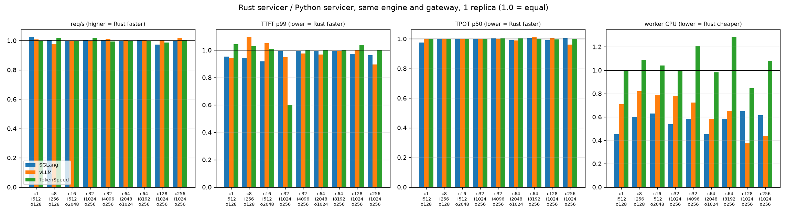

**Requests / s, gRPC servicers behind smg gRPC mode, 1 replica**

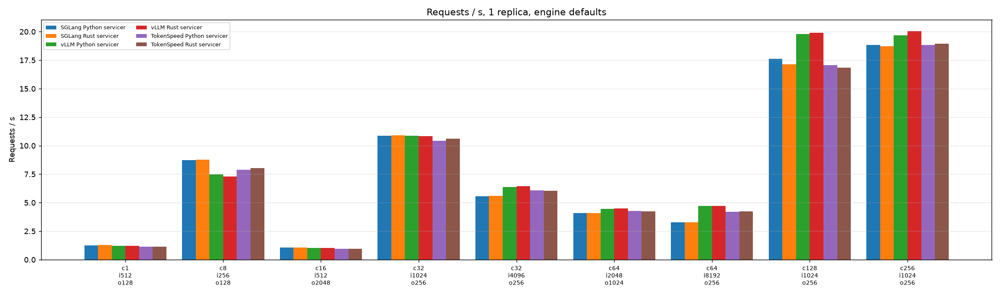

**Requests / s, native servers direct vs behind smg vs smg gRPC with the Rust servicer, 1 replica**

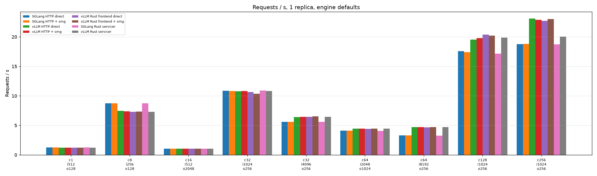

**Output tokens / s, gRPC servicers behind smg gRPC mode, 1 replica**

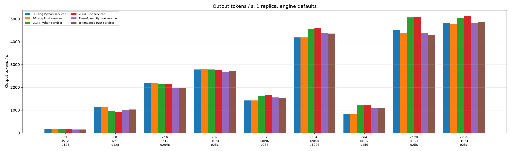

**Output tokens / s, native servers direct vs behind smg vs smg gRPC with the Rust servicer, 1 replica**

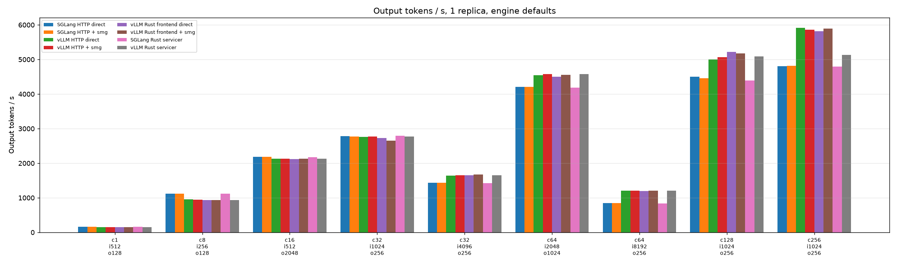

**TTFT p50 (ms), gRPC servicers behind smg gRPC mode, 1 replica**

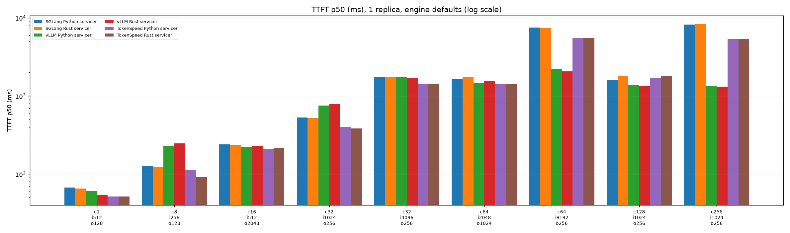

**TTFT p50 (ms), native servers direct vs behind smg vs smg gRPC with the Rust servicer, 1 replica**

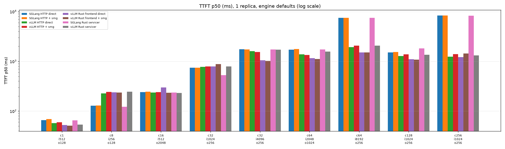

**TTFT p99 (ms), gRPC servicers behind smg gRPC mode, 1 replica**

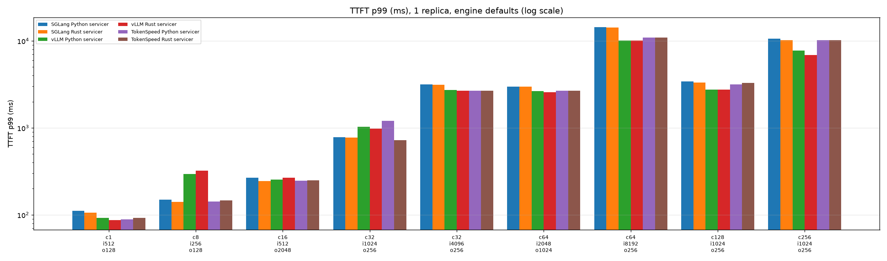

**TTFT p99 (ms), native servers direct vs behind smg vs smg gRPC with the Rust servicer, 1 replica**

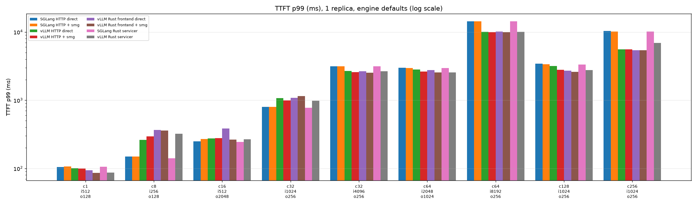

**TPOT p50 (ms), gRPC servicers behind smg gRPC mode, 1 replica**

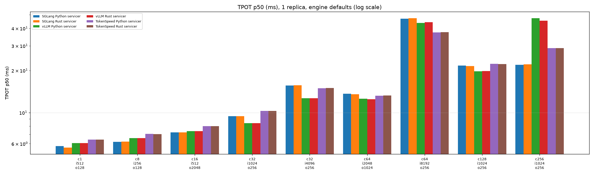

**TPOT p50 (ms), native servers direct vs behind smg vs smg gRPC with the Rust servicer, 1 replica**

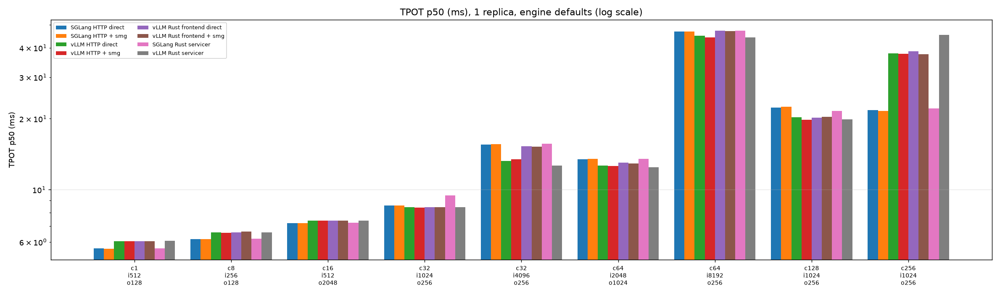

**End-to-end p99 (ms), gRPC servicers behind smg gRPC mode, 1 replica**

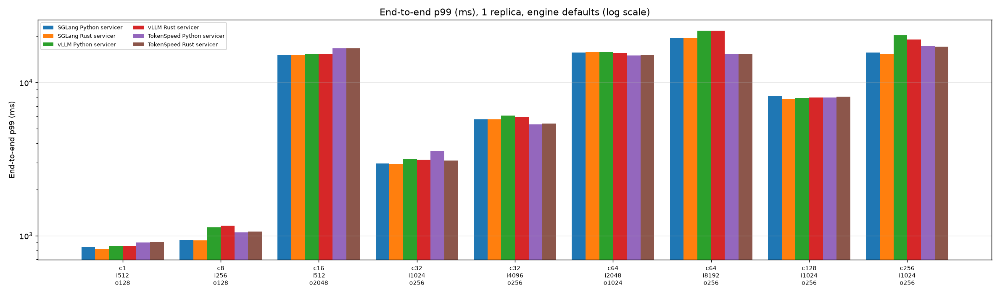

**End-to-end p99 (ms), native servers direct vs behind smg vs smg gRPC with the Rust servicer, 1 replica**

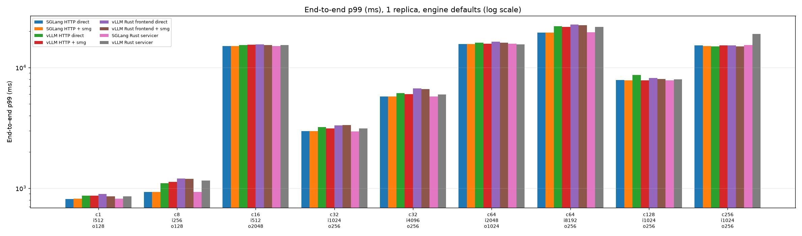

**Worker-tree CPU (s), gRPC servicers behind smg gRPC mode, 1 replica**

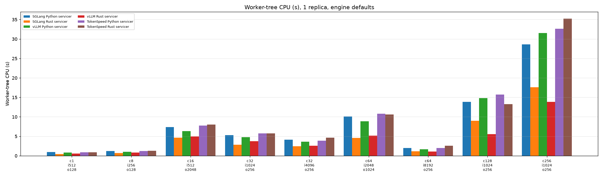

**Worker-tree CPU (s), native servers direct vs behind smg vs smg gRPC with the Rust servicer, 1 replica**

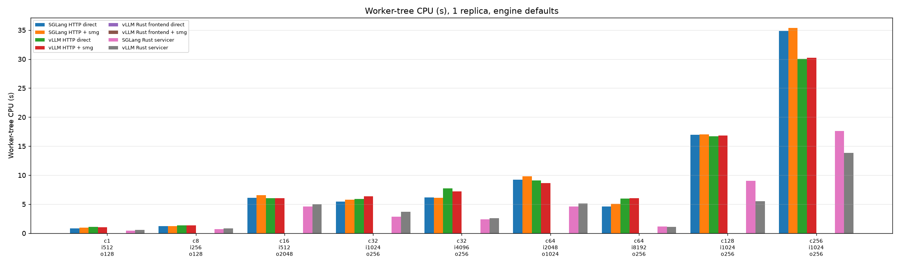

**smg CPU (s), gRPC servicers behind smg gRPC mode, 1 replica**

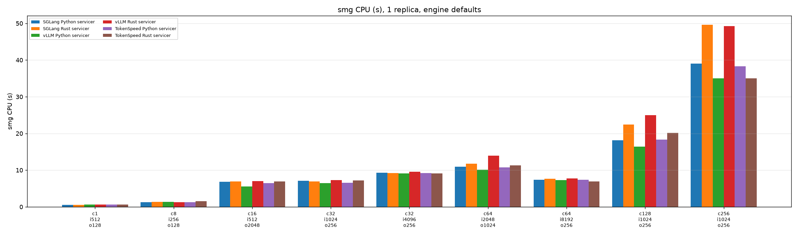

**smg CPU (s), native servers direct vs behind smg vs smg gRPC with the Rust servicer, 1 replica**

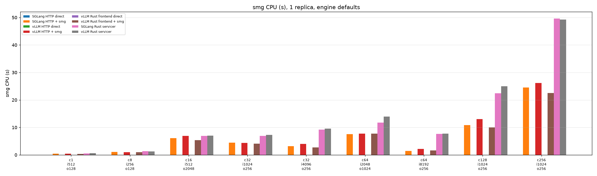

## Caveats

- Defaults are the fair baseline, not the fastest configuration of any engine; each has tuning headroom this study does not explore, and the engine-vs-engine numbers should be read that way.
- TokenSpeed JIT-compiles kernels on first use; that cost sits in startup and a warm-up pass over every shape, outside the measured runs.
- At 128 clients and above the engines queue requests themselves, so TTFT reflects scheduler admission far more than the servicer or the gateway.
- The Rust and Python servicers of an engine drive the same engine processes, so the worker-tree CPU difference between them is the servicer's own cost.
- The client ran on the same host as the servers; at the lowest-latency shapes the client's own overhead is part of every number equally.

## Raw data and full report

- `report.html` (self-contained, charts embedded) and `report.pdf`: [https://github.com/smg-project/artifacts/tree/main/benchmarks/2026-10-04-servicer-rust-vs-python-qwen3.8-27b-nvfp4](https://github.com/smg-project/artifacts/tree/main/benchmarks/2026-10-04-servicer-rust-vs-python-qwen3.8-27b-nvfp4)
- Per-run data: `data/runs.csv`, `data/runs.json`, `data/runs.xml`; per-cell means: `data/summary.csv`; the benchmark client's own JSON for every run: `data/raw/` ([https://github.com/smg-project/artifacts/tree/main/benchmarks/2026-10-04-servicer-rust-vs-python-qwen3.8-27b-nvfp4/data](https://github.com/smg-project/artifacts/tree/main/benchmarks/2026-10-04-servicer-rust-vs-python-qwen3.8-27b-nvfp4/data)).
- Harness: smg's `bench2.py` client (length-pinned `/v1/completions` load), a driver that brings up one worker set at a time, waits for every worker's gRPC health check, starts smg, warms up, then runs the shapes.
